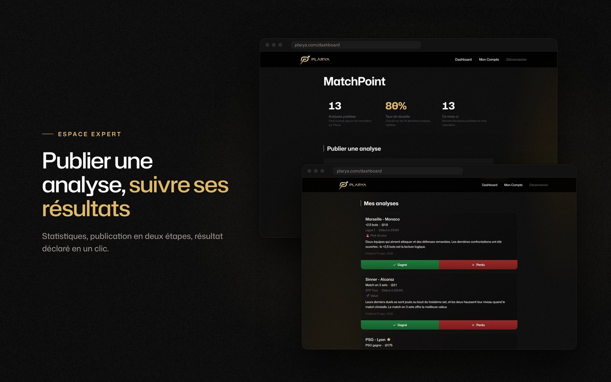

<h1 align="center">Plarya</h1>

<p align="center">
  Plateforme d'analyses sportives publiées par des experts, accessibles à la journée ou par abonnement.<br>
  <a href="https://plarya.com">plarya.com</a> (pré-lancement, accès restreint)
</p>

<p align="center">
  
  
  
  
  
  
  
  
</p>

<p align="center">
  
</p>

<p align="center">
  
  
  
</p>

<p align="center">
  <sub>Experts du jour · Analyses verrouillées avant l'achat · Espace expert</sub>
</p>

---

## Stack

- **Frontend** : Next.js 16 (App Router + Server Components), React 19, Tailwind v4, TypeScript 5
- **Backend** : Express 5, Prisma 7, PostgreSQL, TypeScript 6
- **Auth** : Magic-link (Resend), session cookies httpOnly + CSRF double-submit
- **Paiements** : Stripe Checkout — day pass (paiement unique), abonnement mensuel à un expert,
  abonnement expert trimestriel (compte EXPERT créé au webhook)
- **Logs** : pino structuré, masquage PII (emails)

## Architecture

```
plarya/
├── frontend/    Next.js — UI utilisateur
└── backend/     Express + Prisma — API REST + webhooks Stripe
```

## Setup local

1. Cloner le repo
2. Installer Postgres local sur `:5432`, créer une DB `plarya`
3. Backend :
   ```bash
   cd backend
   cp .env.example .env   # renseigner DATABASE_URL + Stripe + Resend
   npm install
   npx prisma migrate dev
   npm run db:seed
   npm run dev            # port 4000
   ```
4. Frontend (dans un autre terminal) :
   ```bash
   cd frontend
   cp .env.example .env.local
   npm install
   npm run dev            # port 3000
   ```
5. (Optionnel) Pour tester les webhooks Stripe en local :
   ```bash
   stripe listen --forward-to localhost:4000/webhooks/stripe
   ```

## Variables d'environnement

Voir [`frontend/.env.example`](frontend/.env.example) et [`backend/.env.example`](backend/.env.example).

## Outillage

- **Linting** : ESLint (frontend uniquement, `npm run lint`)
- **Formatting** : Prettier partagé via [`.prettierrc`](.prettierrc) à la racine — `npx prettier --write .`
  ou `npm run format` dans chaque package
- **Type-checking** : `npx tsc --noEmit` côté frontend et backend
- **Dependabot** : PRs mensuelles groupées, alertes de sécurité au fil de l'eau (cf. [`.github/dependabot.yml`](.github/dependabot.yml))

## Licence

Repo public à des fins de portfolio dev — utilisation, reproduction ou
réutilisation du code soumise à autorisation préalable.
